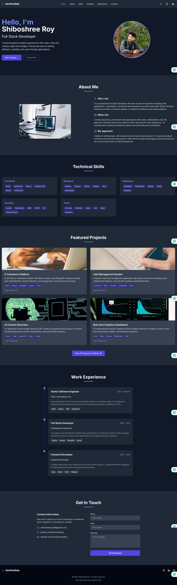
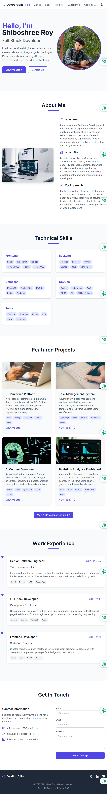
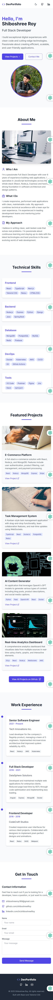
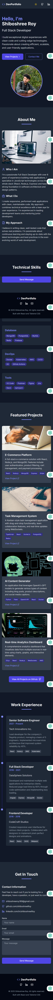

# DevPortfolio - Professional Developer Portfolio



## 🚀 [Live Demo](https://nihalroymatz.netlify.app/)

A modern, responsive portfolio website built for developers to showcase their skills, projects, and professional experience. This portfolio features a clean design with dark mode support, smooth scrolling navigation, and interactive elements.

## ✨ Features

- **Responsive Design** - Looks great on all devices from mobile to desktop
- **Dark/Light Mode** - Toggle between dark and light themes with automatic system preference detection
- **Smooth Scrolling** - Seamless navigation between sections
- **Interactive UI** - Hover effects, transitions, and animations for an engaging user experience
- **Project Showcase** - Highlight your best work with images, descriptions, and technology tags
- **Skills Section** - Organized display of technical skills by category
- **Work Experience Timeline** - Visual representation of professional history
- **Contact Form** - Allow visitors to reach out directly through the website
- **SEO Optimized** - Meta tags and semantic HTML for better search engine visibility

## 🛠️ Technologies Used

- **React** - Frontend library for building user interfaces
- **TypeScript** - Static typing for more reliable code
- **Tailwind CSS** - Utility-first CSS framework for rapid UI development
- **Vite** - Next-generation frontend tooling for faster development
- **Lucide React** - Beautiful, consistent icon set

## 📋 Sections

1. **Hero** - Eye-catching introduction with call-to-action buttons
2. **About** - Personal information and professional philosophy
3. **Skills** - Technical capabilities organized by category
4. **Projects** - Portfolio of work with descriptions and technology tags
5. **Experience** - Professional history displayed as an interactive timeline
6. **Contact** - Form and contact information for networking opportunities

## 📱 Mobile Responsive

The portfolio is fully responsive and optimized for various screen sizes:

<div style="display: flex; justify-content: space-between; margin-bottom: 20px;">
  
  
  
</div>

## 🌙 Dark Mode Support

The portfolio includes a toggle for dark/light mode and automatically detects system preferences:

<div style="display: flex; justify-content: space-between; margin-bottom: 20px;">
  
  
</div>

## 🚀 Getting Started

### Prerequisites

- Node.js (v14.0.0 or later)
- npm or yarn

### Installation

1. Clone the repository
   ```bash
   git clone https://github.com/shiboshreeroy/dev-portfolio.git
   cd dev-portfolio
   ```

2. Install dependencies
   ```bash
   npm install
   # or
   yarn
   ```

3. Start the development server
   ```bash
   npm run dev
   # or
   yarn dev
   ```

4. Open your browser and navigate to `http://localhost:5173`

## 🛠️ Customization

### Personal Information

Edit the data in `src/App.tsx` to update:
- Personal details
- Skills
- Projects
- Work experience

### Styling

The project uses Tailwind CSS for styling. You can customize the theme by editing the `tailwind.config.js` file.

### Adding Projects

To add a new project, update the `projects` array in `src/App.tsx`:

```typescript
const projects = [
  {
    title: "Your New Project",
    description: "Description of your project",
    tags: ["React", "Node.js", "MongoDB"],
    link: "https://github.com/yourusername/your-project",
    image: "https://images.unsplash.com/photo-xxxx" // Link to project image
  },
  // ... existing projects
];
```

## 📦 Build for Production

```bash
npm run build
# or
yarn build
```

The build artifacts will be stored in the `dist/` directory.

## 🚀 Deployment

The portfolio is ready for deployment on platforms like Netlify, Vercel, or GitHub Pages.

### Netlify Deployment

1. Push your code to a GitHub repository
2. Log in to Netlify
3. Click "New site from Git"
4. Select your repository
5. Set build command to `npm run build`
6. Set publish directory to `dist`
7. Click "Deploy site"

## 📝 License

This project is licensed under the MIT License - see the LICENSE file for details.

## 🙏 Acknowledgments

- [Unsplash](https://unsplash.com/) for the stock images
- [Lucide Icons](https://lucide.dev/) for the beautiful icon set
- [Tailwind CSS](https://tailwindcss.com/) for the utility-first CSS framework
- [React](https://reactjs.org/) for the frontend library
- [Vite](https://vitejs.dev/) for the build tool

---

Made with ❤️ by Shiboshree Roy